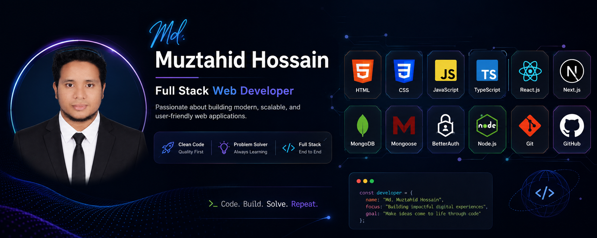

<!-- ===================== BANNER ===================== -->

<!-- ===================== INTRO ===================== -->

# 👋 Hi, I'm Md. Muztahid Hossain

### 🌐 Full Stack Web Developer

---

## 👩‍💻 About Me

I'm **Md. Muztahid Hossain**, a passionate aspiring **Full Stack Web Developer** who enjoys turning ideas into functional, scalable and user-friendly web applications.

I'm currently focused on strengthening my frontend development skills through building real-world projects and improving my problem-solving abilities.

* 🌱 I’m currently learning **Full Stack Web Development**
* ⚛️ Exploring **React.js** and primarily focusing frontend development.
* 🚀 Exploring **Next.js**
* 🛠️ Building real-world projects to improve my development skills
* 💡 Interested in creating clean, responsive and user-friendly websites
* 🎯 My goal is to become a professional **Full Stack Web Developer**
* 🤝 Open to learning, collaboration and new opportunities

---

## 🛠️ Skills in Technologies

  
  
  
  
  
  
  
  
  
  
  
  

---

<!-- ========================================================= -->
<!--                       FOCUS AREAS                          -->
<!-- ========================================================= -->

## 💡 My Focus Areas

- 🌐 Web Development
- 🎨 Frontend Development
- ⚡ JavaScript & ES6
- 🟦 TypeScript
- 🎨 Tailwind CSS
- ⚛️ React
- 📱 Responsive Web Design
- 🚀 Full Stack Web Development
- 🧠 Problem Solving
  
---

## 📍 Social links for Contact

* 📍 **Location:** Bangladesh
* 📧 **Email:** muztahid.2102232@bau.edu.bd
* 💼 **Facebook:** [Md. Muztahid Hossain](https://www.facebook.com/md.muztahid.hossain.232/)
* 🐙 **GitHub:** [muztahid2102232](https://github.com/muztahid2102232)
* 🐙 **Discord:** [Muza_232](https://discordapp.com/users/1529145025227915335)

## 🔥 GitHub Streak

  

---

## 🌐 Connect With Me

---

## 💭 Developer Quote

  <i>"Code. Learn. Build. Improve. Repeat."</i>

---

<h3 align="center">
💙 Thanks for visiting my profile! 💙
</h3>

  

